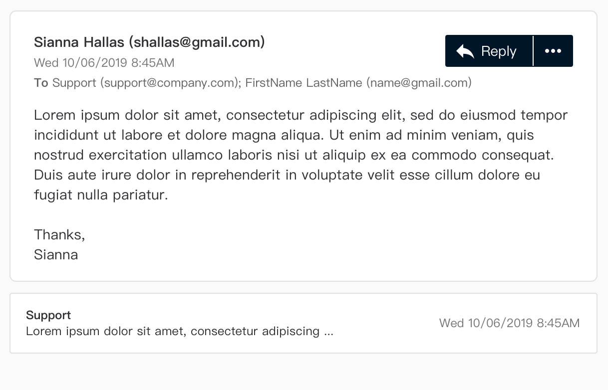

# Frontend Challenge 1 - EmailMessageCard component

Make a new react component for displaying an email message called EmailMessageCard. You can use any existing components from the [antd](https://ant.design/components/overview/) library, with your own styling. You can set up this folder as you would a repository (create-react-app or whatever other boilerplate is ok). Please provide instructions below (e.g. terminal commands for local dev server) on how to show/demo the component.

### Design / behaviour

Here's what the component will look like on a grey background, expanded (upper) and collapsed (lower)



(Accurate image width should be 650px)

If any cc recipients are provided, please display (when expanded) under the `To` recipients


When expanded, click on the ... button to show further options


(Accurate image width should be 290px)

#### Design notes

- The from/to contacts, might have only the email address and no name provided
  - When collapsed
    - If both provided, show only name e.g. "Support"
    - If only email provided, show only email "support@company.com"
  - When expanded
    - If both provided, format **<name> (<email>)** e.g. "Support (support@company.com)"
    - If only email provided, format **<email>** e.g. support@company.com
- Show the contacts separated with a semi-colon character (expanded/collapsed)
- Regarding expanded/collapsing the card...
  - When collapsed
    - Click anywhere on it to expand
  - When expanded
    - Click on the header region (Including: "From" recipient name, datetime, "To" recipient names), to collapse
    - Note: Clicking on any of the buttons (e.g. Reply) in the header region should not collapse it
- For the buttons, find the closest icons you can from antd's provided icon library
- Try to accomodate for large/small screens

### Usage

The component will be used like so...

```
<>
  <EmailMessageCard
    message={{
      id: "1234",
      dateTimeCreated: 1560120300000,
      from: { name: "Sianna Hallas", email: "shallas@gmail.com" },
      to: [
        { name: "Support", email: "support@company.com" },
        { name: "FirstName LastName", email: "name@gmail.com" },
      ],
      cc: [],
      contentPreview:
        "Lorem ipsum dolor sit amet, consectetur adipiscing elit, sed do eiusmod tempor incididunt ut labore et dolore magna aliqua. Ut enim ad minim veniam, quis nostrud exercitation ullamco laboris nisi ut aliquip ex ea commodo consequat. Duis aute irure dolor in",
      content:
        "<p>Lorem ipsum dolor sit amet, consectetur adipiscing elit, sed do eiusmod tempor incididunt ut labore et dolore magna aliqua. Ut enim ad minim veniam, quis nostrud exercitation ullamco laboris nisi ut aliquip ex ea commodo consequat. Duis aute irure dolor in reprehenderit in voluptate velit esse cillum dolore eu fugiat nulla pariatur.</p><p>Thanks,<br />Sianna</p>",
    }}
    defaultExpanded={true}
    onReply={(message) => console.log("onReply", message)}
    onReplyAll={(message) => console.log("onReplyAll", message)}
    onForward={(message) => console.log("onForward", message)}
    onDiscard={(message) => console.log("onDiscard", message)}
    onEscalate={(message) => console.log("onEscalate", message)}
  />

  <EmailMessageCard
    message={{
      id: "1234",
      dateTimeCreated: 1560120300000,
      from: { name: "Support", email: "support@company.com" },
      to: [{ name: "Sianna Hallas", email: "shallas@gmail.com" }],
      cc: [],
      contentPreview:
        "Lorem ipsum dolor sit amet, consectetur adipiscing elit, sed do eiusmod tempor incididunt ut labore et dolore magna aliqua. Ut enim ad minim veniam, quis nostrud exercitation ullamco laboris nisi ut aliquip ex ea commodo consequat. Duis aute irure dolor in",
      content:
        "<p>Lorem ipsum dolor sit amet, consectetur adipiscing elit, sed do eiusmod tempor incididunt ut labore et dolore magna aliqua. Ut enim ad minim veniam, quis nostrud exercitation ullamco laboris nisi ut aliquip ex ea commodo consequat. Duis aute irure dolor in reprehenderit in voluptate velit esse cillum dolore eu fugiat nulla pariatur.</p>",
    }}
    defaultExpanded={false}
    onReply={(message) => console.log("onReply", message)}
    onReplyAll={(message) => console.log("onReplyAll", message)}
    onForward={(message) => console.log("onForward", message)}
    onDiscard={(message) => console.log("onDiscard", message)}
    onEscalate={(message) => console.log("onEscalate", message)}
  />
</>
```

### Tech notes

- Feel free to install the antd Use existing antd components and add your own styling on top
- Please use functional components only as that's our standard at VoiceFoundry
- Try to make it look like the design images above as much as possible. If an antd component forces you to deviate from the design, it might be quicker to just style it yourself without the antd component
- When card is collapsed, show `contentPreview`, when expanded, render the `content` html
- `defaultExpanded` determines if the card is expanded/collapsed initially. Then the user can click to expand/collapse
- On click of the various buttons, invoke the appropriate prop function passing the message as a param
- Note: to/from contacts JSON might not have the name attribute populated

- For extra points! 😍 but not essential
  - Typescript

### How to view/demo component

TODO put instructons here ... e.g.

```sh
$ yarn
```

```sh
$ yarn start
```

# Getting Started with Create React App

This project was bootstrapped with [Create React App](https://github.com/facebook/create-react-app).

## Available Scripts

In the project directory, you can run:

### `yarn start`

Runs the app in the development mode.\
Open [http://localhost:3000](http://localhost:3000) to view it in the browser.

The page will reload if you make edits.\
You will also see any lint errors in the console.

### `yarn test`

Launches the test runner in the interactive watch mode.\
See the section about [running tests](https://facebook.github.io/create-react-app/docs/running-tests) for more information.

### `yarn build`

Builds the app for production to the `build` folder.\
It correctly bundles React in production mode and optimizes the build for the best performance.

The build is minified and the filenames include the hashes.\
Your app is ready to be deployed!

See the section about [deployment](https://facebook.github.io/create-react-app/docs/deployment) for more information.

### `yarn eject`

**Note: this is a one-way operation. Once you `eject`, you can’t go back!**

If you aren’t satisfied with the build tool and configuration choices, you can `eject` at any time. This command will remove the single build dependency from your project.

Instead, it will copy all the configuration files and the transitive dependencies (webpack, Babel, ESLint, etc) right into your project so you have full control over them. All of the commands except `eject` will still work, but they will point to the copied scripts so you can tweak them. At this point you’re on your own.

You don’t have to ever use `eject`. The curated feature set is suitable for small and middle deployments, and you shouldn’t feel obligated to use this feature. However we understand that this tool wouldn’t be useful if you couldn’t customize it when you are ready for it.

## Learn More

You can learn more in the [Create React App documentation](https://facebook.github.io/create-react-app/docs/getting-started).

To learn React, check out the [React documentation](https://reactjs.org/).
